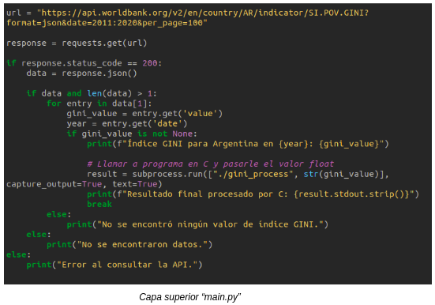
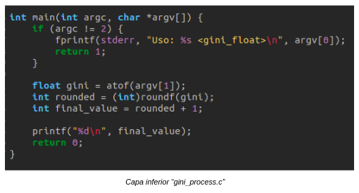
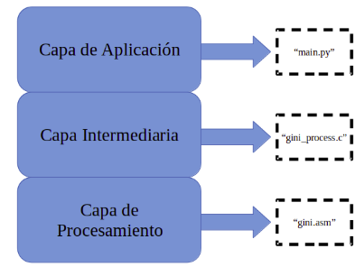
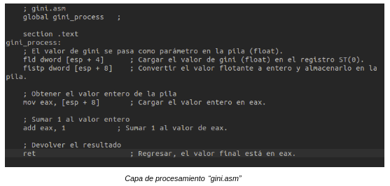
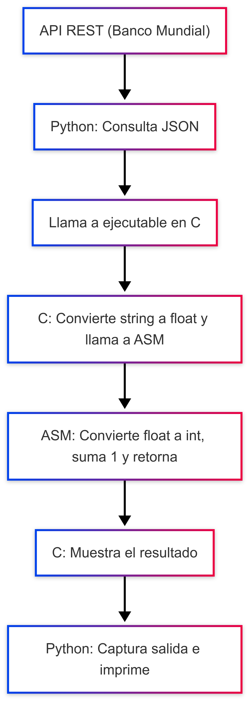

# TP2 - Procesamiento del Índice GINI usando Python, C y Ensamblador (x86)

## ✨ Descripción general
Este trabajo práctico tiene como objetivo implementar una arquitectura en capas que obtenga el Índice GINI desde una API REST, procese el valor usando rutinas en ensamblador mediante una función intermedia en C, y finalmente lo muestre al usuario.

## PRIMERA ITERACIÓN
En una primera iteración, no se utilizará el lenguaje Ensamblador, solamente C y Python. En esta iteración, se utilizarán dos capas, una capa superior realizada en Python (Encargada de obtener los datos requeridos de la API y pasarla a la capa inferior) y una capa de procesamiento de datos programado en C.

Se empezará realizando, en la capa superior, una consulta HTTP a la API del Banco Mundial para obtener el índice GINI de Argentina en los años 2011 a 2020. Utiliza la libreria requests para enviar la solicitud y parsear la respuesta en formato JSON. 

Una vez recibida y validada la respuesta, recorre los datos disponibles hasta encontrar el primer valor no nulo del índice GINI junto con su año correspondiente, y lo imprime en pantalla. 



A continuación, el script llama a un ejecutable externo llamado gini_process usando subprocess.run(), pasándole el valor GINI como argumento en formato string. 

Este ejecutable está implementado en lenguaje C y se encarga de convertir el valor recibido a tipo float, redondearlo al entero más cercano usando la función roundf(), sumarle 1, y luego imprimir el resultado final por la salida estándar.



De esta manera, el programa combina la obtención de datos desde una API con un procesamiento en C para presentar un valor GINI entero ajustado a lo que nosotros necesitamos.


## SEGUNDA ITERACIÓN


En esta segunda etapa del trabajo, ya implementaremos el uso del lenguaje Assembler o Ensamblador, siendo el encargado de procesar los datos provenientes de la API. En esta etapa, el programa se amplió al uso de 3 capas: 



La diferencia con la primera iteración es que ahora la capa que procesaba el dato recibido desde la API, ahora es una capa intermedia que solo llama a una rutina de la capa de procesamiento realizada en lenguaje Ensamblador. Dicha capa es la encargada de gestionar el índice GINI recibido desde la capa superior, pasarlo a un valor entero, sumarle una constante (1 en este caso) y devolver el valor modificado.




## 📊 Flujo del sistema




## 🔧 Tecnologías usadas
- **Python 3** con `requests` y `subprocess`
- **Lenguaje C** con `gcc` para 32 bits
- **Lenguaje ensamblador x86** con NASM
- **GDB** para depuración paso a paso

## 🔄 Convención de llamada usada
Se utilizó el estándar de llamada de C en x86:
- Los argumentos se pasan por el stack (esp)
- El valor de retorno se devuelve en el registro **EAX**

En la función ensambladora:
```asm
fld dword [esp + 4]     ; Carga el float pasado por C
fistp dword [esp + 8]   ; Convierte a entero y guarda en stack
dispositivo
mov eax, [esp + 8]      ; Carga el valor entero a EAX
add eax, 1              ; Suma 1
ret                     ; Retorna a C con resultado en EAX
```

## ⚙️ Compilación
Usar el script `compile.sh`:
```bash
chmod +x compile.sh
./compile.sh
```

Incluye flags:
- `-g3`: para depuración detallada
- `-m32`: para generar código en 32 bits
- `-F dwarf`: para compatibilidad con GDB

## 🔢 Ejecución y depuración
### Ejecutar manualmente:
```bash
./gini_process 42.5
```

### Ejecutar con Python:
```bash
python3 main.py
```

### Depurar con GDB:
```bash
marcktm@marcktm-3120:~/SistComp_TP2$ gdb ./gini_process 
GNU gdb (Ubuntu 15.0.50.20240403-0ubuntu1) 15.0.50.20240403-git
Copyright (C) 2024 Free Software Foundation, Inc.
License GPLv3+: GNU GPL version 3 or later <http://gnu.org/licenses/gpl.html>
This is free software: you are free to change and redistribute it.
There is NO WARRANTY, to the extent permitted by law.
Type "show copying" and "show warranty" for details.
This GDB was configured as "x86_64-linux-gnu".
Type "show configuration" for configuration details.
For bug reporting instructions, please see:
<https://www.gnu.org/software/gdb/bugs/>.
Find the GDB manual and other documentation resources online at:
    <http://www.gnu.org/software/gdb/documentation/>.

For help, type "help".
Type "apropos word" to search for commands related to "word"...
Reading symbols from ./gini_process...
(gdb) break main
Punto de interrupción 1 at 0x11cc: file gini_process.c, line 7.
(gdb) run 42.5
Starting program: /home/marcktm/SistComp_TP2/gini_process 42.5
[Depuración de hilo usando libthread_db enabled]
Using host libthread_db library "/lib/x86_64-linux-gnu/libthread_db.so.1".

Breakpoint 1, main (argc=2, argv=0xffffce34) at gini_process.c:7
7           if (argc != 2) {
(gdb) list
2       #include <stdlib.h>
3
4       extern int gini_process(float gini_value); // Declaramos la función ensambladora
5
6       int main(int argc, char *argv[]) {
7           if (argc != 2) {
8               fprintf(stderr, "Uso: %s <gini_float>\n", argv[0]);
9               return 1;
10          }
11
(gdb) next
13          float gini = atof(argv[1]);
(gdb) list
8               fprintf(stderr, "Uso: %s <gini_float>\n", argv[0]);
9               return 1;
10          }
11
12          // Convertir el argumento a float
13          float gini = atof(argv[1]);
14
15          // Llamar a la rutina en ensamblador
16          int result = gini_process(gini);
17
(gdb) next
16          int result = gini_process(gini);
(gdb) step
gini_process () at gini.asm:7
7           fld dword [esp + 4]      ; Cargar el valor de gini (float) en el registro ST(0).
(gdb) disassemble
Dump of assembler code for function gini_process:
=> 0x56556250 <+0>:     flds   0x4(%esp)
   0x56556254 <+4>:     fistpl 0x8(%esp)
   0x56556258 <+8>:     mov    0x8(%esp),%eax
   0x5655625c <+12>:    add    $0x1,%eax
   0x5655625f <+15>:    ret
End of assembler dump.
(gdb) info registers eax
eax            0x0                 0
(gdb) stepi
8           fistp dword [esp + 8]    ; Convertir el valor flotante a entero y almacenarlo en la pila.
(gdb) stepi
11          mov eax, [esp + 8]       ; Cargar el valor entero en eax.
(gdb) stepi
14          add eax, 1            ; Sumar 10 al valor de eax.
(gdb) info registers eax
eax            0x2a                42
(gdb) stepi
17          ret                      ; Regresar, el valor final está en eax (registro de retorno en x86).
(gdb) info registers eax
eax            0x2b                43
(gdb) 
```

## 🔎 Validación con GDB
- Se visualiza el argumento en `[esp + 4]`
- Se confirma la carga, conversión y suma en `eax`
- Resultado esperado: Si el valor es `42.5`, se convierte a `42`, suma `1`, y se devuelve `43`

## Análisis de performance

Se realizaron pruebas para comparar el rendimiento entre la ejecución en C puro y el uso completo de la aplicación en Python (con llamada a C + ASM):

### Resultado con time (C puro):

```bash
marcktm@marcktm-3120:~/SistComp_TP2$ time ./gini_process 42.5
Índice GINI procesado +1: 43

real    0m0,009s
user    0m0,005s
sys     0m0,004s
marcktm@marcktm-3120:~/SistComp_TP2$
```

###  Resultado con perf stat:

```bash
marcktm@marcktm-3120:~/SistComp_TP2$ perf stat ./gini_process 42.5
Índice GINI procesado +1: 43

 Performance counter stats for './gini_process 42.5':

              0,97 msec task-clock                       #    0,545 CPUs utilized             
                 1      context-switches                 #    1,026 K/sec                     
                 0      cpu-migrations                   #    0,000 /sec                      
                54      page-faults                      #   55,400 K/sec                     
         2.648.616      cycles                           #    2,717 GHz                       
         1.230.300      instructions                     #    0,46  insn per cycle            
           222.960      branches                         #  228,741 M/sec                     
             9.247      branch-misses                    #    4,15% of all branches           

       0,001788065 seconds time elapsed

       0,000000000 seconds user
       0,001686000 seconds sys


marcktm@marcktm-3120:~/SistComp_TP2$ 
```

### Resultado desde Python:

```bash
marcktm@marcktm-3120:~/SistComp_TP2$ time python3 main.py
Índice GINI para Argentina en 2020: 42.7
Resultado final procesado en ASM: Índice GINI procesado +1: 44

real    0m0,843s
user    0m0,242s
sys     0m0,046s
marcktm@marcktm-3120:~/SistComp_TP2$
```
## 📌 Conclusión:

El ejecutable en C es extremadamente rápido y eficiente, ideal para procesamiento bajo nivel.

Python introduce mayor tiempo por la carga del intérprete, el request HTTP y la creación del proceso hijo.

El uso de perf stat permite observar métricas internas como instrucciones por ciclo, fallos de página y misses de branch.

## Análisis de memoria con Valgrind


```bash
marcktm@marcktm-3120:~/SistComp_TP2$ valgrind ./gini_process 42.5
==12889== Memcheck, a memory error detector
==12889== Copyright (C) 2002-2022, and GNU GPL'd, by Julian Seward et al.
==12889== Using Valgrind-3.22.0 and LibVEX; rerun with -h for copyright info
==12889== Command: ./gini_process 42.5
==12889== 
Índice GINI procesado +1: 43
==12889== 
==12889== HEAP SUMMARY:
==12889==     in use at exit: 0 bytes in 0 blocks
==12889==   total heap usage: 1 allocs, 1 frees, 1,024 bytes allocated
==12889== 
==12889== All heap blocks were freed -- no leaks are possible
==12889== 
==12889== For lists of detected and suppressed errors, rerun with: -s
==12889== ERROR SUMMARY: 0 errors from 0 contexts (suppressed: 0 from 0)
marcktm@marcktm-3120:~/SistComp_TP2$

```
- No hay fugas de memoria.

- Todo el uso del heap fue correctamente liberado.

- El programa es seguro desde el punto de vista de memoria dinámica.

## 📄 Checklist de entrega
- [x] API REST funcionando y consulta en Python
- [x] Valor de GINI extraído correctamente
- [x] Comunicación Python → C → ASM y retorno
- [x] Suma +1 correcta y devuelta a C
- [x] Visualización con `print` y validación en GDB
- [x] Repositorio GitHub con `README.md`, `compile.sh`, `gini.asm`, `gini_process.c`, `main.py`

# Guía de Instalación - TP2: Índice GINI con Python, C y Ensamblador

Este proyecto implementa una arquitectura de software en capas para procesar el Índice GINI usando datos extraídos desde una API REST. La capa superior está desarrollada en Python, la intermedia en C, y la capa inferior en lenguaje ensamblador x86.

---

## 🔧 Requisitos del sistema

- Linux 64 bits (probado en Ubuntu 22.04)
- Python 3 (≥ 3.6)
- `gcc` con soporte para 32 bits (`gcc-multilib`)
- `NASM` (Netwide Assembler)
- `make` (opcional)
- Acceso a internet (para consumir la API del Banco Mundial)

---

## 📦 Dependencias necesarias

Instalación de herramientas requeridas:

```bash
sudo apt update
sudo apt install gcc-multilib g++-multilib nasm python3 python3-pip
```

---

## 📁 Estructura del proyecto

```
SistComp_TP2/
├── build/               # Binarios y archivos compilados
├── img/                 # Diagramas e imágenes
├── src/                 # Código fuente del proyecto
│   ├── gini_process.c
│   ├── gini.asm
│   ├── main.py
│   └── compile.sh
├── .gitignore
├── README.md
└── install.md           # Guía de instalación (este archivo)
```

---

## ⚙️ Instrucciones de instalación y ejecución

### 1. Clonar el repositorio

```bash
git clone https://github.com/TomasAlejo/SistComp_TP2.git
cd SistComp_TP2/src
```

### 2. Compilar el proyecto

```bash
chmod +x compile.sh
./compile.sh
```

Esto creará el ejecutable `gini_process` dentro de la carpeta `build/`.

---

### 3. Ejecutar directamente el binario 

```bash
cd ../build
./gini_process 42.5
```

---

### 4. Ejecutar desde Python (modo completo)

Desde la carpeta `src/`:

```bash
python3 main.py
```

Este script:
- Recupera el índice GINI desde la API del Banco Mundial.
- Pasa el valor a un ejecutable en C.
- El programa en C llama una rutina en ensamblador para procesarlo.


---

## 📚 Bibliografía utilizada
- Paul A. Carter - Lenguaje Ensamblador para PC (2007). http://pacman128.github.io/pcasm/
- Documentación oficial de GDB. https://www.gnu.org/software/gdb/
- Guía rápida GDB y NASM, Ubuntu 22.04 (multilib)
- Ejemplos de uso de ctypes: https://es.stackoverflow.com/questions/102982/puedo-insertar-c%C3%B3digo-c-en-python

